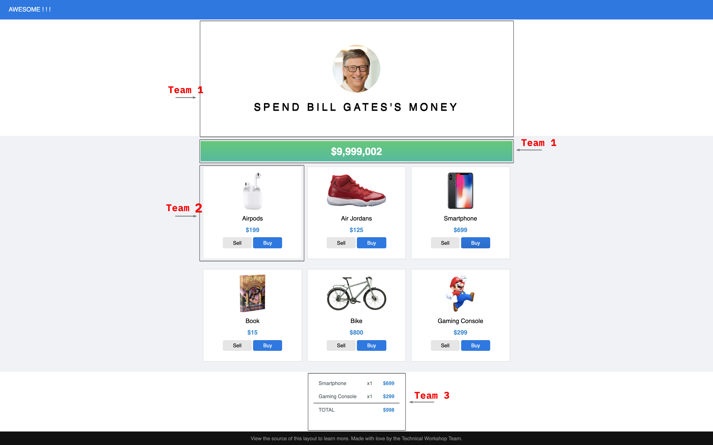

# micro-frontend
This application is built with micro frontend approach in which a front-end app is decomposed into individual “microapps” working loosely together. 
## Micro frontend process
[View the process here..](documentation/micro_frontend_process.svg)
## Situation
Inspired by https://neal.fun/spend/

Bill Gates is one of billionaires in the world. He's very rich. He has a lot of money. For that reason, today we will together help him spent his money on our application.

We want to build an application with ONE main features is sell / buy the product which will have some requirements:
1. Display Bill remaining money after _buy / sell_ some products.
2. Display a list of products, each product should have _buy / sell_ action.
3. Show and update the receipt on every _buy / sell_ action.

We decide that the application is splited into *multiple fragments*.  
So that all the teams can work indepently and the team do their fragment freely choose the framework they want.

## How to run app in local
To run the integrated app in local, you must checkout 3 additional repositories: [micro-frontend-team-one](https://github.com/hgky95/micro-frontend-team-one), [micro-frontend-team-two](https://github.com/hgky95/micro-frontend-team-two) and [micro-frontend-team-three](https://github.com/hgky95/micro-frontend-team-three).  

Then simply run `docker-compose up --build`
